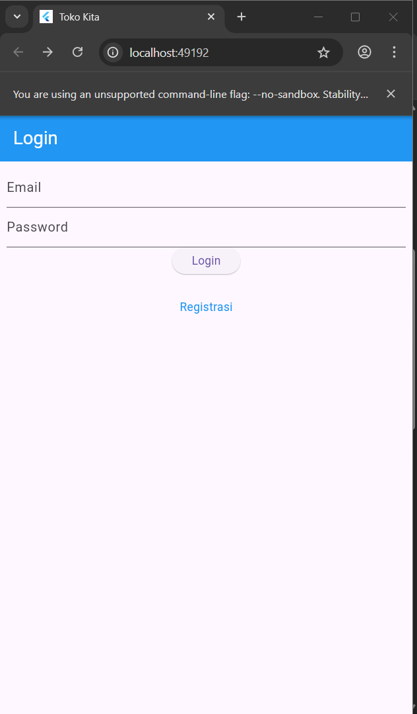
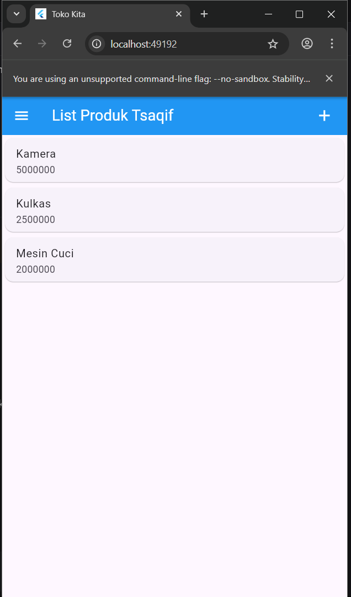
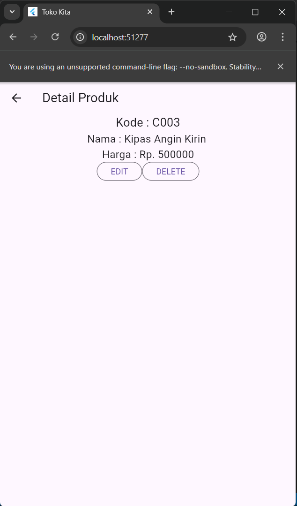
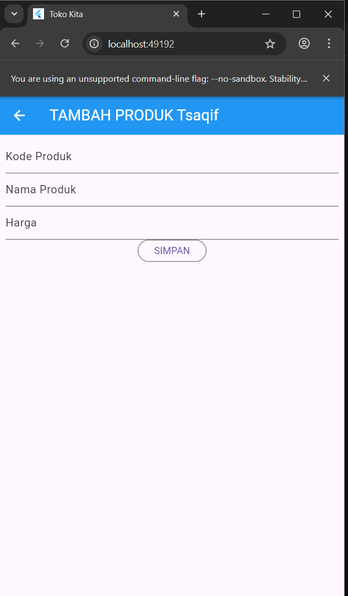
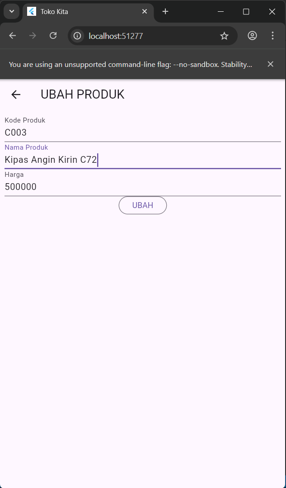
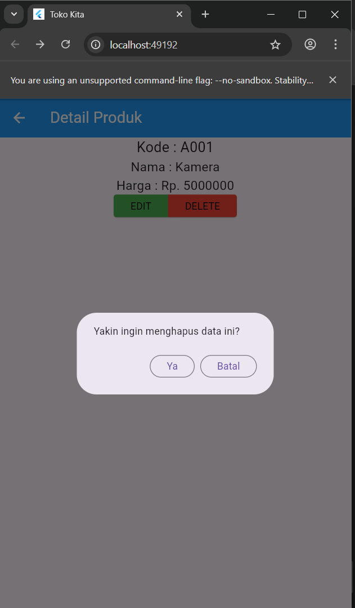

# Tokokita

Aplikasi mobile management produk toko yang dibangun menggunakan Flutter. Aplikasi ini menyediakan fitur CRUD (Create, Read, Update, Delete) untuk manajemen produk serta sistem autentikasi user.

## Proses Registrasi

### a. Form Registrasi


User mengisi form registrasi dengan data berikut:

- **Nama**: Minimal 3 karakter
- **Email**: Format email yang valid
- **Password**: Minimal 6 karakter
- **Konfirmasi Password**: Harus sama dengan password

**Kode Validasi Form:**

```dart
Widget _namaTextField() {
  return TextFormField(
    decoration: const InputDecoration(labelText: "Nama"),
    keyboardType: TextInputType.text,
    controller: _namaTextboxController,
    validator: (value) {
      if (value!.length < 3) {
        return "Nama harus diisi minimal 3 karakter";
      }
      return null;
    },
  );
}

Widget _emailTextField() {
  return TextFormField(
    decoration: const InputDecoration(labelText: "Email"),
    keyboardType: TextInputType.emailAddress,
    controller: _emailTextboxController,
    validator: (value) {
      if (value!.isEmpty) {
        return 'Email harus diisi';
      }
      Pattern pattern = r'^(([^<>()[\]\\.,;:\s@\"]+(\.[^<>()[\]\\.,;:\s@\"]+)*)|(\".+\"))@((\[[0-9]{1,3}\.[0-9]{1,3}\.[0-9]{1,3}\.[0-9]{1,3}\])|(([a-zA-Z\-0-9]+\.)+[a-zA-Z]{2,}))$';
      RegExp regex = RegExp(pattern.toString());
      if (!regex.hasMatch(value)) {
        return "Email tidak valid";
      }
      return null;
    },
  );
}
```

### b. Proses Submit Registrasi

Setelah form divalidasi, data dikirim ke backend melalui RegistrasiBloc.

**Kode Submit:**

```dart
void _submit() {
  _formKey.currentState!.save();
  setState(() {
    _isLoading = true;
  });
  RegistrasiBloc.registrasi(
    nama: _namaTextboxController.text,
    email: _emailTextboxController.text,
    password: _passwordTextboxController.text,
  ).then(
    (value) {
      showDialog(
        context: context,
        barrierDismissible: false,
        builder: (BuildContext context) => SuccessDialog(
          description: "Registrasi berhasil, silahkan login",
          okClick: () {
            Navigator.pop(context);
          },
        ),
      );
    },
    onError: (error) {
      showDialog(
        context: context,
        barrierDismissible: false,
        builder: (BuildContext context) => const WarningDialog(
          description: "Registrasi gagal, silahkan coba lagi",
        ),
      );
    },
  );
}
```

**Kode API Registrasi di RegistrasiBloc:**

```dart
static Future<Registrasi> registrasi({
  String? nama,
  String? email,
  String? password,
}) async {
  String apiUrl = ApiUrl.registrasi;
  var body = {"nama": nama, "email": email, "password": password};
  var response = await Api().post(apiUrl, body);
  var jsonObj = json.decode(response.body);
  return Registrasi.fromJson(jsonObj);
}
```

### c. Dialog Sukses/Gagal Registrasi

Jika registrasi berhasil, akan muncul SuccessDialog dengan pesan "Registrasi berhasil, silahkan login". Jika gagal, muncul WarningDialog dengan pesan "Registrasi gagal, silahkan coba lagi".

---

## Proses Login

### a. Form Login



User memasukkan email dan password pada form login.

**Kode Form Login:**

```dart
Widget _emailTextField() {
  return TextFormField(
    decoration: const InputDecoration(labelText: "Email"),
    keyboardType: TextInputType.emailAddress,
    controller: _emailTextboxController,
    validator: (value) {
      if (value!.isEmpty) {
        return 'Email harus diisi';
      }
      return null;
    },
  );
}

Widget _passwordTextField() {
  return TextFormField(
    decoration: const InputDecoration(labelText: "Password"),
    keyboardType: TextInputType.text,
    obscureText: true,
    controller: _passwordTextboxController,
    validator: (value) {
      if (value!.isEmpty) {
        return "Password harus diisi";
      }
      return null;
    },
  );
}
```

### b. Proses Autentikasi

Setelah form divalidasi, aplikasi akan mengirim request ke API melalui LoginBloc.

**Kode Submit Login:**

```dart
void _submit() {
  _formKey.currentState!.save();
  setState(() {
    _isLoading = true;
  });
  LoginBloc.login(
    email: _emailTextboxController.text,
    password: _passwordTextboxController.text,
  ).then(
    (value) async {
      if (value.code == 200) {
        await UserInfo().setToken(value.token.toString());
        await UserInfo().setUserID(int.parse(value.userID.toString()));
        Navigator.pushReplacement(
          context,
          MaterialPageRoute(builder: (context) => const ProdukPage()),
        );
      } else {
        showDialog(
          context: context,
          barrierDismissible: false,
          builder: (BuildContext context) => const WarningDialog(
            description: "Login gagal, silahkan coba lagi",
          ),
        );
      }
    },
    onError: (error) {
      showDialog(
        context: context,
        barrierDismissible: false,
        builder: (BuildContext context) => const WarningDialog(
          description: "Login gagal, silahkan coba lagi",
        ),
      );
    },
  );
}
```

**Kode API Login di LoginBloc:**

```dart
static Future<Login> login({String? email, String? password}) async {
  String apiUrl = ApiUrl.login;
  var body = {"email": email, "password": password};
  var response = await Api().post(apiUrl, body);
  var jsonObj = json.decode(response.body);
  return Login.fromJson(jsonObj);
}
```

### c. Login Berhasil

Jika login berhasil (code 200), token dan userID disimpan menggunakan SharedPreferences melalui UserInfo, kemudian user diarahkan ke halaman List Produk.

### d. Login Gagal

Jika login gagal, akan muncul WarningDialog dengan pesan "Login gagal, silahkan coba lagi".

---

## Proses Melihat Data Produk (Read)

### a. List Produk Page



Halaman menampilkan daftar produk dalam bentuk ListView. Setiap item produk ditampilkan dalam Card dengan nama produk dan harga.

**Kode Menampilkan List Produk:**

```dart
body: ListView(
  children: [
    ItemProduk(
      produk: Produk(
        id: '1',
        kodeProduk: 'A001',
        namaProduk: 'Kamera',
        hargaProduk: 5000000,
      ),
    ),
    // ... produk lainnya
  ],
)
```

**Kode Item Produk Widget:**

```dart
class ItemProduk extends StatelessWidget {
  final Produk produk;
  const ItemProduk({Key? key, required this.produk}) : super(key: key);

  @override
  Widget build(BuildContext context) {
    return GestureDetector(
      onTap: () {
        Navigator.push(
          context,
          MaterialPageRoute(builder: (context) => ProdukDetail(produk: produk)),
        );
      },
      child: Card(
        child: ListTile(
          title: Text(produk.namaProduk!),
          subtitle: Text(produk.hargaProduk.toString()),
        ),
      ),
    );
  }
}
```

### b. Detail Produk



Ketika user tap pada item produk, aplikasi akan menampilkan detail lengkap produk beserta tombol EDIT dan DELETE.

**Kode Detail Produk:**

```dart
body: Center(
  child: Column(
    children: [
      Text(
        "Kode : ${widget.produk!.kodeProduk}",
        style: const TextStyle(fontSize: 20.0),
      ),
      Text(
        "Nama : ${widget.produk!.namaProduk}",
        style: const TextStyle(fontSize: 18.0),
      ),
      Text(
        "Harga : Rp. ${widget.produk!.hargaProduk.toString()}",
        style: const TextStyle(fontSize: 18.0),
      ),
      _tombolHapusEdit(),
    ],
  ),
)
```

---

## Proses Tambah Data Produk (Create)

### a. Form Tambah Produk



User mengakses form tambah produk dengan menekan icon (+) di AppBar halaman List Produk. Form berisi input untuk Kode Produk, Nama Produk, dan Harga.

**Kode Form Input:**

```dart
Widget _kodeProdukTextField() {
  return TextFormField(
    decoration: const InputDecoration(labelText: "Kode Produk"),
    keyboardType: TextInputType.text,
    controller: _kodeProdukTextboxController,
    validator: (value) {
      if (value!.isEmpty) {
        return "Kode Produk harus diisi";
      }
      return null;
    },
  );
}
```

### b. Proses Simpan Produk

Setelah form divalidasi, data produk dikirim ke API melalui ProdukBloc.

**Kode Simpan:**

```dart
simpan() {
  setState(() {
    _isLoading = true;
  });
  Produk createProduk = Produk(id: null);
  createProduk.kodeProduk = _kodeProdukTextboxController.text;
  createProduk.namaProduk = _namaProdukTextboxController.text;
  createProduk.hargaProduk = int.parse(_hargaProdukTextboxController.text);

  ProdukBloc.addProduk(produk: createProduk).then(
    (value) {
      Navigator.of(context).push(
        MaterialPageRoute(
          builder: (BuildContext context) => const ProdukPage(),
        ),
      );
    },
    onError: (error) {
      showDialog(
        context: context,
        builder: (BuildContext context) => const WarningDialog(
          description: "Simpan gagal, silahkan coba lagi",
        ),
      );
    },
  );
}
```

**Kode API Tambah Produk di ProdukBloc:**

```dart
static Future addProduk({Produk? produk}) async {
  String apiUrl = ApiUrl.createProduk;
  var body = {
    "kode_produk": produk!.kodeProduk,
    "nama_produk": produk.namaProduk,
    "harga": produk.hargaProduk.toString(),
  };
  var response = await Api().post(apiUrl, body);
  var jsonObj = json.decode(response.body);
  return jsonObj['status'];
}
```

### c. Notifikasi Sukses/Gagal

Jika berhasil, user diarahkan kembali ke halaman List Produk. Jika gagal, muncul WarningDialog.

---

## Proses Edit Data Produk (Update)

### a. Form Edit Produk



User menekan tombol EDIT pada halaman detail produk. Form akan terisi otomatis dengan data produk yang akan diedit.

**Kode Inisialisasi Data:**

```dart
isUpdate() {
  if (widget.produk != null) {
    setState(() {
      judul = "UBAH PRODUK";
      tombolSubmit = "UBAH";
      _kodeProdukTextboxController.text = widget.produk!.kodeProduk!;
      _namaProdukTextboxController.text = widget.produk!.namaProduk!;
      _hargaProdukTextboxController.text = widget.produk!.hargaProduk.toString();
    });
  }
}
```

### b. Proses Update Produk

Data yang sudah diubah dikirim ke API melalui ProdukBloc.

**Kode Update:**

```dart
ubah() {
  setState(() {
    _isLoading = true;
  });
  Produk updateProduk = Produk(id: widget.produk!.id!);
  updateProduk.kodeProduk = _kodeProdukTextboxController.text;
  updateProduk.namaProduk = _namaProdukTextboxController.text;
  updateProduk.hargaProduk = int.parse(_hargaProdukTextboxController.text);

  ProdukBloc.updateProduk(produk: updateProduk).then(
    (value) {
      Navigator.of(context).push(
        MaterialPageRoute(
          builder: (BuildContext context) => const ProdukPage(),
        ),
      );
    },
    onError: (error) {
      showDialog(
        context: context,
        builder: (BuildContext context) => const WarningDialog(
          description: "Permintaan ubah data gagal, silahkan coba lagi",
        ),
      );
    },
  );
}
```

**Kode API Update Produk di ProdukBloc:**

```dart
static Future updateProduk({required Produk produk}) async {
  String apiUrl = ApiUrl.updateProduk(int.parse(produk.id!));
  var body = {
    "kode_produk": produk.kodeProduk,
    "nama_produk": produk.namaProduk,
    "harga": produk.hargaProduk.toString(),
  };
  var response = await Api().put(apiUrl, jsonEncode(body));
  var jsonObj = json.decode(response.body);
  return jsonObj['status'];
}
```

---

## Proses Hapus Data Produk (Delete)

### a. Konfirmasi Hapus



User menekan tombol DELETE pada halaman detail produk, kemudian muncul AlertDialog konfirmasi.

**Kode Dialog Konfirmasi:**

```dart
void confirmHapus() {
  AlertDialog alertDialog = AlertDialog(
    content: const Text("Yakin ingin menghapus data ini?"),
    actions: [
      OutlinedButton(
        child: const Text("Ya"),
        onPressed: () {
          ProdukBloc.deleteProduk(id: int.parse(widget.produk!.id!)).then(
            (value) => {
              Navigator.of(context).push(
                MaterialPageRoute(builder: (context) => const ProdukPage()),
              ),
            },
            onError: (error) {
              showDialog(
                context: context,
                builder: (BuildContext context) => const WarningDialog(
                  description: "Hapus gagal, silahkan coba lagi",
                ),
              );
            },
          );
        },
      ),
      OutlinedButton(
        child: const Text("Batal"),
        onPressed: () => Navigator.pop(context),
      ),
    ],
  );
  showDialog(builder: (context) => alertDialog, context: context);
}
```

### b. Proses Delete Produk

Jika user menekan "Ya", request hapus dikirim ke API melalui ProdukBloc.

**Kode API Delete Produk di ProdukBloc:**

```dart
static Future<bool> deleteProduk({int? id}) async {
  String apiUrl = ApiUrl.deleteProduk(id!);
  var response = await Api().delete(apiUrl);
  var jsonObj = json.decode(response.body);
  return (jsonObj as Map<String, dynamic>)['data'];
}
```

### c. Notifikasi Sukses/Gagal

Jika berhasil, user diarahkan ke halaman List Produk. Jika gagal, muncul WarningDialog dengan pesan "Hapus gagal, silahkan coba lagi".

---

## Struktur Folder

```
lib/
├── bloc/           # Business logic layer (LoginBloc, RegistrasiBloc, ProdukBloc)
├── helpers/        # Helper classes (API, ApiUrl, UserInfo)
├── model/          # Data models (Login, Registrasi, Produk)
├── ui/             # User interface pages
└── widget/         # Reusable widgets (WarningDialog, SuccessDialog)
```

## Teknologi

- Flutter SDK
- Dart Programming Language
- HTTP Package untuk REST API
- SharedPreferences untuk local storage
